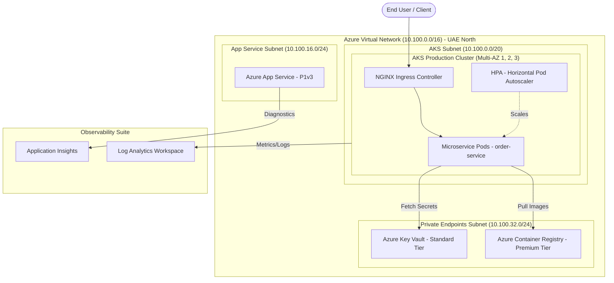

# Technical Interview Presentation & Case Study Guide

This document is your step-by-step cheat sheet to present and explain this Terraform infrastructure solution during your technical interview.

---

## 1. Executive Summary & Architecture Overview

> **Elevator Pitch**:  
> *"I designed an enterprise-grade, highly available production infrastructure in the Azure UAE North (`uaenorth`) region using modular Terraform code, Azure DevOps CI/CD pipelines, and standard Kubernetes manifests. The setup deploys AKS across 3 Availability Zones, ACR Premium, App Service with VNet Integration, Key Vault, and centralized Log Analytics monitoring."*

---

## 2. Key Technical Highlights & Interview Answers

### Q1: How did you implement Network Security Groups (NSGs)?
* **Your Answer**:  
  *"I used dynamic blocks (`dynamic "security_rule"`) driven by nested Terraform maps. Instead of hardcoding individual `azurerm_network_security_rule` resources, each NSG receives a map of security rule objects. The dynamic block iterates over this map to configure priority, protocol, access, and port ranges cleanly. Subnets are then programmatically associated with their corresponding NSG using `azurerm_subnet_network_security_group_association`."*

### Q2: Why did you eliminate `outputs.tf` and use `data.tf` instead?
* **Your Answer**:  
  *"To decouple module dependency chains and avoid brittle output coupling, I eliminated `outputs.tf` across child modules. Instead, root environment execution files use `data.tf` to look up created resource attributes (like Subnet IDs, Log Analytics IDs, and ACR IDs) dynamically by name and resource group. To ensure proper creation order before querying data sources, modules explicitly declare `depends_on = [module.resource_group, module.azure_network, ...]`."*

### Q3: How is High Availability (HA) achieved?
* **Your Answer**:  
  * **AKS**: Spread across **3 Availability Zones** (`zones = ["1", "2", "3"]`) with an initial pool of 3 `Standard_D4s_v5` nodes and auto-scaling enabled up to 6 nodes.
  * **App Service**: Deployed on a Premium V3 (`P1v3`) plan with VNet integration for private backend connectivity.
  * **ACR**: Premium tier with multi-region geo-replication capabilities and private link support.

### Q4: How is Security implemented?
* **Your Answer**:  
  * **Passwordless Authentication**: Managed Identities are used; AKS uses its system-assigned kubelet identity with an automated `AcrPull` RBAC role assignment on the ACR.
  * **Key Vault**: Purge protection and 90-day soft delete enabled.
  * **Kubernetes Hardening**: Container security context enforces `runAsNonRoot: true`, unprivileged user IDs (`10001`), drops Linux capabilities (`drop: [ALL]`), and enforces CPU/memory requests and limits.

---

## 3. Azure DevOps Pipeline Architecture

The `azure-pipelines-terraform.yml` pipeline implements a standard 3-stage GitOps workflow:
1. **Validate**: Runs `terraform validate` and `tfsec` security static code analysis.
2. **Plan**: Generates execution plan (`terraform plan`), converts to JSON, and publishes the plan artifact.
3. **Apply**: Runs on merge to `main`, targeting the `Production` environment in Azure DevOps, which triggers an automated **Manual Approval Gate** before executing `terraform apply`.

---

## 4. Bill of Quantity (BOQ) Summary (UAE North)

* **Monthly Estimated Cost**: ~$887.30 USD
* **Annual Estimated Cost**: ~$10,647.60 USD
* **Breakdown**:
  * **AKS Nodes (3x D4s_v5)**: ~$490.50/mo
  * **App Service (P1v3)**: ~$167.90/mo
  * **ACR Premium**: ~$50.00/mo
  * **Monitoring (Log Analytics 30GB/mo ingestion)**: ~$69.00/mo
  * **Security (Defender for Containers)**: ~$89.00/mo
* **Cost Optimization Talking Point**: Recommending **3-Year Reserved Instances (RI)** for AKS nodes in UAE North reduces node compute costs by ~55% (saving ~$270/month).
