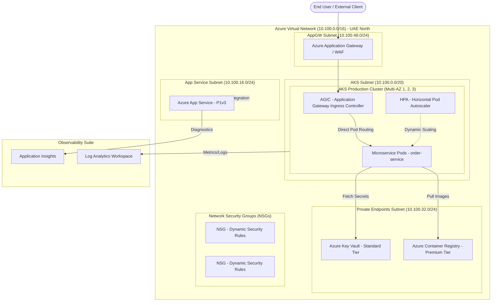

# Azure Production Infrastructure Case Study (UAE North Region)

This repository contains an enterprise-grade, highly available production infrastructure design deployed in the **Azure UAE North (`uaenorth`)** region using **Modular Terraform**, **Azure DevOps CI/CD Pipelines**, and **Kubernetes Manifests**.

---

## 🏛️ Architecture Overview



---

## ✨ Key Features & Technical Decisions

### 1. Dynamic NSG Rules
* Network Security Groups iterate over nested rules dynamically using `dynamic "security_rule"` blocks driven by map variables (`vnets`, `subnets`, `nsgs`).

### 2. Output-Free Data Lookup Pattern (`data.tf`)
* Eliminates output dependencies between child modules (`outputs.tf`).
* Downstream resources dynamically resolve dependency attributes via `data.tf` lookups (e.g. `data "azurerm_subnet"`), with module execution order enforced via `depends_on = [...]`.

### 3. Native AGIC (Application Gateway Ingress Controller)
* Direct pod-level L7 routing using Azure Application Gateway / WAF, bypassing intermediate proxies for lower latency and enhanced security.

### 4. 5-Stage Azure DevOps CI/CD Pipeline
* **`PrecommitStage`**: Code formatting (`terraform fmt -check`), validation, `tflint`, and static security scanning with `tfsec`.
* **`InfraCostStage`**: FinOps cost calculation breakdown before deployment.
* **`PlanStage`**: Generates execution plan (`terraform plan -out=tfplan`) and publishes pipeline artifact.
* **`ManualValidationStage`**: Pauses deployment for manual sign-off via `ManualValidation@0`.
* **`ApplyStage`**: Executes `terraform apply tfplan` upon approval.

---

## 📁 Repository Folder Structure

```
.
├── Architecture/
│   └── architecture.mermaid         # Visual architecture diagram
├── Azure_DevOps_Pipelines/
│   └── azure-pipelines-terraform.yml # 5-Stage ADO CI/CD pipeline
├── BOQ/
│   └── UAE_North_BOQ.md             # Bill of Quantity for UAE North
├── Kubernetes_Manifests/
│   ├── deployment.yaml              # Production Deployment with securityContext & probes
│   ├── service.yaml                 # ClusterIP Service
│   ├── ingress.yaml                 # AGIC Ingress Configuration
│   ├── hpa.yaml                     # Autoscaling 2-10 replicas based on CPU/RAM
│   ├── storageclass.yaml            # Azure Premium Disk CSI StorageClass
│   └── pvc.yaml                     # Persistent Volume Claim
└── Terraform/
    ├── Environments/
    │   ├── Dev/                     # Development environment workspace
    │   └── Prod/                    # Production environment workspace
    └── Modules/
        ├── ACR/                     # Container Registry Module
        ├── AKS/                     # Kubernetes Service Module (Multi-AZ)
        ├── App_Service/             # Linux App Service & VNet Integration
        ├── Azure_Network/           # VNet, Subnets & NSGs with Dynamic Blocks
        ├── Key_Vault/               # Key Vault Module
        ├── Monitoring/              # Log Analytics Workspace & App Insights
        └── Resource_Group/          # Resource Group Module
```

---

## 💰 Cost Summary (UAE North)

* **Estimated Monthly Cost**: ~$887.30 USD
* **Estimated Annual Cost**: ~$10,647.60 USD
* Detailed breakdown available in [`BOQ/UAE_North_BOQ.md`](BOQ/UAE_North_BOQ.md).

---

## 🚀 How to Deploy Locally

```bash
# Navigate to Production environment
cd Terraform/Environments/Prod

# Initialize Terraform
terraform init

# Validate configuration
terraform validate

# Generate execution plan
terraform plan

# Apply infrastructure changes
terraform apply
```
